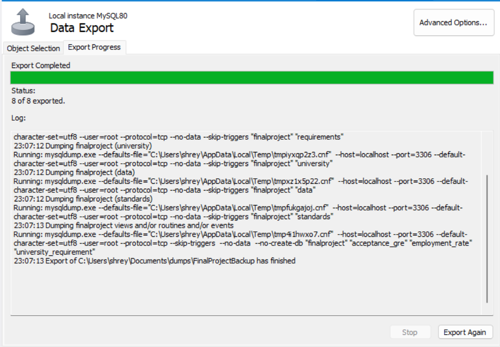

# Project Report for Info 16149 - Data Management and Data Design

## Topic Name:  
Profile Evaluation and University Shortlisting
 

1) Data collection :
Dataset which was required for this project is gathered in a form of CSV file from Kaggle and by web scrapping ("YMGrad" website). The scraped data was then merged in the CSV file based on the university name in the file.

CSV file reference : Kaggle.com

Web scrapping : YMGrad.com

2) Data cleaning :
The dataset which was gathered was cleaned. All the unnecessary columns were removed from the dataset. Handled all the null values.

3) Audit :
Performed audit check on the dataset collected.
    - Checked correctness of the data.
    - Checked validation of the data
    - Verified uniqueness of the dataset
    - Validated accuracy of the data collected
    - Determined completness of the dataset

Null value check:

Data completness output:

Data validity :

Data Uniqueness:

4) Data insertion :
After cleaning and audting, the data is inserted into the respective tables using mysql connector through python. The schema that was created is :

5) SQL Queries :
    - Views
        1. View for university requirements. (Joining University and REquirements table)
            
        2. View for University name, GRE score and acceptance rate.
            
        3. View for the university and employment rate. (Joining University and Standards table)
            

    - Triggers
        1. Created trigger to enter 0 in Requirements table after each entry in University table.

                Output : 

                INSERT INTO University(University_ID, University_Name, Country, Chance_of_Admit, University_Rating, National_Rank)VALUES ('402', 'test', 'test', '1000', '1000', '1000');

            
            
        
        2. Trigger to calculate count of university inserted.That count can be used for evaluation.

                Output : 
                After inserting the records in the table,
            

    - Procedures
        1. Procedure to fetrch the university requirements of a specific university.
            
            Output :
            

    - Indexes

            -- Creating index
            Create index university_id
            on University(University_id);

            -- Creating index on GRE
            Create index GRE_idx
            on Requirements(GRE);

            -- Creating index on TOEFL
            Create index toefl_idx
            on Requirements(TOEFL);

            -- Creating index on University_ID
            Create index std_uid_idx
            on Standards(University_id);

            -- Creating index on Quality of Education
            Create index qoe_idx
            on Standards(Quality_of_education);

            -- Creating index on University Name
            Create index Uni_name_idx
            on University(University_Name);

        
        
        

6) Visualization:
Performed visualization for the collected data. For visualization we have used Seaborn and matplotlib.

    - Boxplot :
    Implemented boxplot graph for University rating and Chance of Admit. Representing chance of rating depending upon chance of admit.
    

    - Lineplot : 
    Represented chance of admit based on GRE score using Lineplot graph.
    

    - Figure : 
    Analysed chance of admit based in the Figure graph.
    

    - Pie Chart
    Represented number of university in various Countries.
    

6) Prediction : Linear Regression
Performed linear regression to predict the chance of admit based on the given profile. Trained a model using 70% of the dataset available and then performed testing using the remaining dataset i.e 30%.

Accuracy of the developed model is : 0.728

Given a User profile the chance of admit predicted is :

7) Backup and Restore
We have also taken a backup of our database. So that in case of any causality we can restore it.

8) User Interface:
User will first register in the website.

User will then login into the website using his credentials.

Once the user logs in, he can seach for the universities based on his profile by entering his GRE score, TOEFL score and CGPA 

User can also search the university by giving university name which will give all the details of the searched university.

